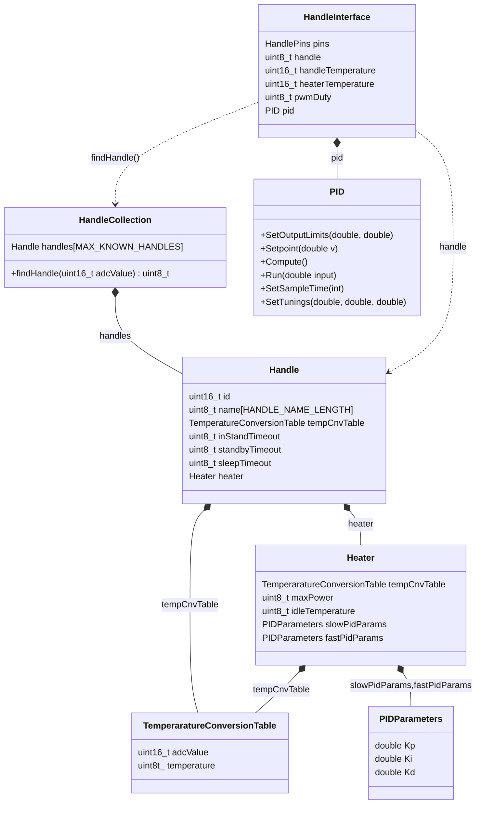

```mermaid
classDiagram
    class Handle {
        uint16_t id
        uint8_t name[HANDLE_NAME_LENGTH]
        TemperatureConversionTable tempCnvTable
        uint8_t inStandTimeout
        uint8_t standbyTimeout
        uint8_t sleepTimeout
        Heater heater
    }

    class TemperaratureConversionTable {
        uint16_t adcValue
        uint8t_ temperature
    }

    Handle *-- TemperaratureConversionTable :tempCnvTable

    class Heater {
        TemperaratureConversionTable tempCnvTable
        uint8_t maxPower
        uint8_t idleTemperature
        PIDParameters slowPidParams
        PIDParameters fastPidParams
    }

    class PIDParameters {
        double Kp
        double Ki
        double Kd
    }

    Heater *-- PIDParameters : slowPidParams,fastPidParams

    Handle *-- Heater : heater
    Heater *-- TemperaratureConversionTable : tempCnvTable

    class HandleCollection {
        Handle handles[MAX_KNOWN_HANDLES]
        +findHandle(uint16_t adcValue) uint8_t
    }

    HandleCollection *-- Handle : handles

    class HandleInterface {
        HandlePins pins
        uint8_t handle
        uint16_t handleTemperature
        uint16_t heaterTemperature
        uint8_t  pwmDuty
        PID pid
    }

    class PID {
        +SetOutputLimits(double, double)
        +Setpoint(double v)
        +Compute()
        +Run(double input)
        +SetSampleTime(int)
        +SetTunings(double, double, double)
    }

    HandleInterface ..> HandleCollection : findHandle()
    HandleInterface ..> Handle : handle

    HandleInterface *-- PID : pid
```
