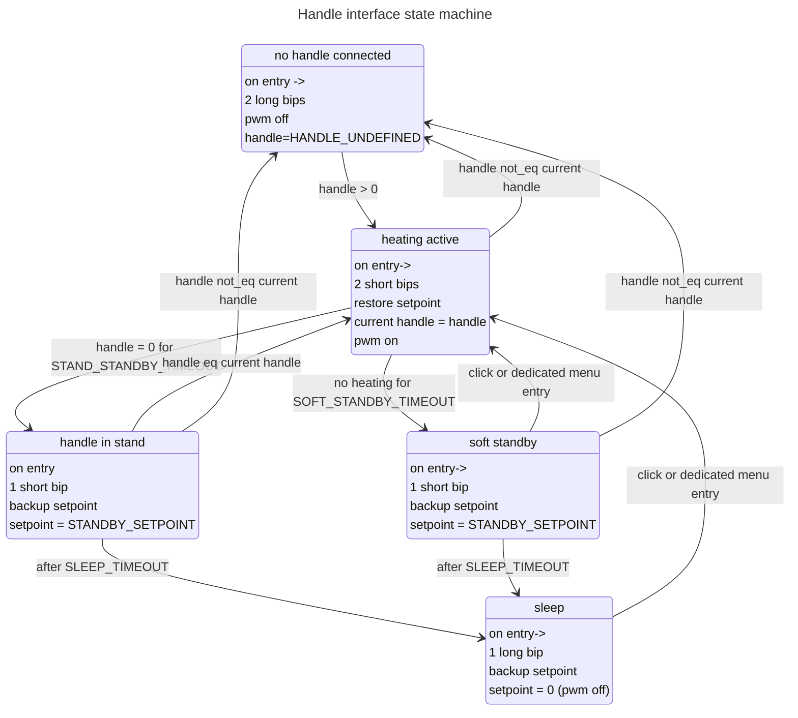

```mermaid
---
title: Handle interface state machine
---
stateDiagram-v2

state "no handle connected" as nc: on entry ->\n2 long bips\npwm off\nhandle=HANDLE_UNDEFINED
state "soft standby" as soft: on entry->\n1 short bip\nbackup setpoint\nsetpoint = STANDBY_SETPOINT
state "heating active" as active: on entry->\n2 short bips\nrestore setpoint\ncurrent handle = handle\npwm on
state "handle in stand" as stand: on entry\n1 short bip\nbackup setpoint\nsetpoint = STANDBY_SETPOINT
state "sleep" as sleep:  on entry->\n1 long bip\nbackup setpoint\nsetpoint = 0 (pwm off)

nc --> active : handle > 0

soft --> active : click or dedicated menu entry
active --> soft : no heating for SOFT_STANDBY_TIMEOUT
active --> stand : handle = 0 for STAND_STANDBY_TIMEOUT
stand --> active : handle eq current handle

stand --> sleep : after SLEEP_TIMEOUT
soft --> sleep : after SLEEP_TIMEOUT
sleep --> active : click or dedicated menu entry

soft --> nc : handle not_eq current handle
active --> nc : handle not_eq current handle
stand --> nc : handle not_eq current handle
```
sleep --> nc : handle not_eq current handle
